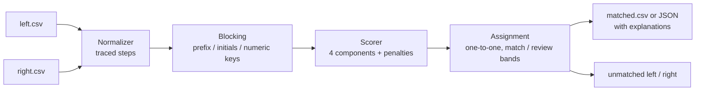

# nearjoin

[English](README.md) | [中文](README.zh.md) | [日本語](README.ja.md)

[](LICENSE) [](CHANGELOG.md) [](pyproject.toml)  [](CONTRIBUTING.md)

**名前や住所で 2 つのデータセットをあいまい結合するオープンソースツール — 依存ゼロ、すべてのマッチに説明可能なスコア付き。**


```bash
git clone https://github.com/JaydenCJ/nearjoin && cd nearjoin && pip install -e .
```

> **プレリリース：** nearjoin はまだ PyPI に公開されていません。最初のリリースまでは [JaydenCJ/nearjoin](https://github.com/JaydenCJ/nearjoin) をクローンし、リポジトリのルートで `pip install -e .` を実行してください。

## なぜ nearjoin？

2 つのシステムから出力された顧客リストの突合は、どこにでもあり、退屈で、Excel が最も苦手とする仕事です。VLOOKUP は最初の "Acme, Inc." 対 "ACME Corporation" で息絶え、重量級のレコードリンケージフレームワークが返す答えは、設定し、学習させ、そのうえで「*なぜ 40 行目が 7 行目とマッチしたのか*」だけを知りたい関係者に弁明しなければならない確率モデルです。nearjoin は逆に賭けました：全過程を記録する決定的な正規化、4 つの透明な類似度コンポーネント、明示的なペナルティ — 出力のどのスコアも [docs/scoring.md](docs/scoring.md) に従って手計算で再現できます。あえて ML レコードリンケージフレームワークには**なりません**：学習データも学習済み重みも SQL バックエンドも不要 — 数百万行とラベル付きマッチがあるなら Splink を、手元にあるのが 2 つのエクスポートと締め切りならこれを。

|  | nearjoin | Splink | dedupe | RapidFuzz |
|---|---|---|---|---|
| コマンド 1 つで CSV から CSV への結合 | はい | いいえ（Python + SQL バックエンド） | いいえ（まず学習セッション） | いいえ（類似度ライブラリのみ） |
| マッチごとの説明 | コンポーネント + ペナルティ + 正規化トレース | モデルパラメータ（m/u 確率） | 分類器の確信度 | 生スコアのみ |
| 学習データやラベル付けが必要 | いいえ | EM 学習 / 事前分布 | はい（能動学習） | いいえ |
| 名前/住所の正規化を内蔵 | はい、全ステップ記録 | 自前で用意 | 自前で用意 | なし |
| 数字のずれ（"123" 対 "125"）を証拠として扱う | はい、明示的ペナルティ | 設定次第 | 学習依存で不透明 | なし |
| ランタイム依存 | 0 | DuckDB、pandas など | scikit-learn 一式 | コンパイル済み C++ 拡張 |

<sub>依存数は 2026-07 時点で各パッケージが PyPI に宣言しているランタイム要件：splink 4.x と dedupe 3.x はそれぞれ数値計算/SQL スタックを引き込み、RapidFuzz は単一のコンパイル済み wheel。nearjoin の数は [pyproject.toml](pyproject.toml) の `dependencies = []` です。</sub>

## 特長

- **すべてのスコアが説明責任を果たす** — 各マッチはコンポーネント（`token_sort=0.82; char=0.93; …`）、ペナルティ、両側に実際に適用された正規化ステップを携え、`nearjoin score --json` は内訳全体をデータとして出力します。
- **ランタイム依存ゼロ** — 純粋な標準ライブラリ、オフライン、決定的：同じ 2 ファイルは、どのマシンでも毎回バイト単位で同一の出力を生みます。
- **ドメインを理解した正規化、決して黙って行わない** — 法人格接尾辞（`Inc`、`GmbH`、`Ltd` の長短表記）、`&`→`and`、アクセント、アポストロフィ、USPS 式住所略記（`Street`→`st`、`Fifth`→`5th`）— 各ステップが記録され、説明の中でそのまま再生されます。
- **数字は文字ではなく証拠** — "123 Main St" 対 "125 Main St" は文字列としては 95% 類似でも建物としては 100% 別物；明示的な `numeric_mismatch` ペナルティがマッチから排除し、理由を述べます。
- **ブロッキングを内蔵し、効果を計測** — プレフィックス・頭文字・数字キーがスコアリング前に直積を刈り込み（同梱サンプルで 92% スキップ）、サマリーは実際に比較したペア数を正確に報告します。
- **偽りの自信ではなくレビュー帯を** — スコアは `match`（≥85）、`review`（70–85）、非マッチのいずれかに落ち、貪欲な 1 対 1 割り当ては決定的で、同点は行順で解決します。
- **CSV 入力、CSV または JSON 出力** — プレフィックス付き列名で衝突を回避し、`--unmatched-left/right` が残り物を回収、サマリーは stderr へ流れ stdout はパイプ可能なまま。

## クイックスタート

インストール：

```bash
git clone https://github.com/JaydenCJ/nearjoin && cd nearjoin && pip install -e .
```

同梱の 2 つのサンプルエクスポートを社名列で結合します：

```bash
nearjoin join examples/customers_crm.csv examples/customers_billing.csv \
  --left-on name --right-on customer
```

実際に取得した出力（CSV は stdout、サマリーは stderr；`...` で省略）：

```text
left_id,left_name,...,match_score,match_verdict,match_explanation
C001,"Acme, Inc.",...,100,match,exact after normalization ('acme')
C003,Smith & Sons Ltd,...,100,match,exact after normalization ('smith and sons')
C004,Northwind Traders,...,77.6,review,token_sort=0.82; token_overlap=0.50; char=0.93; alignment=0.79
C007,Café Aurora,...,100,match,exact after normalization ('cafe aurora')
...
nearjoin: 12 left rows x 11 right rows [kind=name]
  matched 9, review 1, unmatched left 2, unmatched right 1
  blocking compared 10 of 132 possible pairs (92% skipped)
```

任意のペアを尋問できます — これが経理へのメールにそのまま貼れる出力です：

```bash
nearjoin score "123 Main St" "125 Main St" --kind address
```

```text
score 56.6 / 100  [address]
  left : '123 Main St' -> '123 main st'
         - case-folded
  right: '125 Main St' -> '125 main st'
         - case-folded
  components:
    token_sort    0.909 x 30%  edit similarity after sorting tokens ('123 main st' vs '125 main st')
    token_overlap 0.667 x 20%  shared tokens: main, st (only left: 123; only right: 125)
    char          0.952 x 25%  Jaro-Winkler over '123 main st' vs '125 main st'
    alignment     0.889 x 25%  average similarity of each token to its best counterpart
  penalties:
    numeric_mismatch -30  numbers disagree: left has {123}, right has {125}
```

## CLI リファレンス

| キー | デフォルト | 効果 |
|---|---|---|
| `--left-on` / `--right-on` | 必須 / 左と同じ | 各ファイルの結合列 |
| `--kind` | `auto` | `name`、`address`、またはデータから自動判定 |
| `--threshold` | `85` | この値以上のペアを `match` として採用 |
| `--review` | `70` | `[review, threshold)` のペアを人手レビュー対象に |
| `--many` | オフ | 1 つの右行が複数の左行に対応可能（デフォルトは 1 対 1） |
| `--format` | `csv` | `json` はマッチごとに完全な説明を含む |
| `-o`、`--unmatched-left`、`--unmatched-right` | stdout / — | マッチと残り物をファイルへ書き出す |
| `--no-explain` / `--quiet` | オフ | 説明列を省く / サマリーを黙らせる |

スコアモデル — コンポーネント、重み、ペナルティ、計算例 — は [docs/scoring.md](docs/scoring.md) に規定；`nearjoin keys VALUE` は任意の値の正規化過程と付与されるブロッキングキーを表示します。0.1.0 の正規化ルールはラテン文字の名前と米国式住所が対象で、他ロケールのデータは汎用パイプラインを無傷で通過しますがドメインルールの恩恵はありません。

## 検証

このリポジトリは CI を一切同梱せず、上記の主張はすべてローカル実行で検証されています。本リポジトリのチェックアウトから再現できます：

```bash
pip install -e '.[dev]' && pytest && bash scripts/smoke.sh
```

出力（実際の実行から転記、`...` で省略）：

```text
91 passed in 0.55s
...
[score]     numeric_mismatch -30  numbers disagree: left has {123}, right has {125}
SMOKE OK
```

## アーキテクチャ



## ロードマップ

- [x] トレース付き正規化、ブロッキング、透明なスコアモデル、レビュー帯付き 1 対 1 割り当て、CSV/JSON CLI（v0.1.0）
- [ ] PyPI への公開と `pip install nearjoin`
- [ ] より多くのロケールと住所形式に対応する差し替え可能な正規化ルールパック
- [ ] 複数列結合：名前と住所の証拠を 1 つのスコアに統合
- [ ] 数百万行入力向けのチャンク/ストリーミングモード

完全な一覧は [open issues](https://github.com/JaydenCJ/nearjoin/issues) を参照してください。

## コントリビュート

コントリビュート歓迎です — [good first issue](https://github.com/JaydenCJ/nearjoin/issues?q=is%3Aissue+is%3Aopen+label%3A%22good+first+issue%22) から始めるか、[discussion](https://github.com/JaydenCJ/nearjoin/discussions) を立ててください。開発環境のセットアップは [CONTRIBUTING.md](CONTRIBUTING.md) を参照。

## ライセンス

[MIT](LICENSE)
