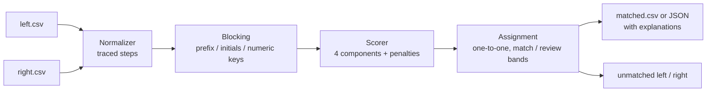

# nearjoin

[English](README.md) | [中文](README.zh.md) | [日本語](README.ja.md)

[](LICENSE) [](CHANGELOG.md) [](pyproject.toml)  [](CONTRIBUTING.md)

**Open-source fuzzy join for two datasets on names or addresses — zero dependencies, and every match ships with an explainable score.**


```bash
git clone https://github.com/JaydenCJ/nearjoin && cd nearjoin && pip install -e .
```

> **Pre-release:** nearjoin is not yet published to PyPI. Until the first release, clone [JaydenCJ/nearjoin](https://github.com/JaydenCJ/nearjoin) and run `pip install -e .` from the repository root.

## Why nearjoin?

Reconciling customer lists from two systems is universal, dull, and Excel-hostile: VLOOKUP dies on the first "Acme, Inc." vs "ACME Corporation", and the heavyweight record-linkage frameworks answer with a probabilistic model you must configure, train, and then defend to a stakeholder who just wants to know *why row 40 matched row 7*. nearjoin takes the opposite bet: deterministic normalization with a recorded trace, four transparent similarity components, and explicit penalties — so every score in the output can be recomputed by hand from [docs/scoring.md](docs/scoring.md). It is deliberately **not** an ML record-linkage framework: no training data, no learned weights, no SQL backend — if you have millions of rows and labeled matches, use Splink; if you have two exports and a deadline, use this.

|  | nearjoin | Splink | dedupe | RapidFuzz |
|---|---|---|---|---|
| One-command CSV-to-CSV join | Yes | No (Python + SQL backend) | No (training session first) | No (similarity library only) |
| Per-match explanation | components + penalties + normalization trace | model parameters (m/u probabilities) | classifier confidence | raw score only |
| Needs training data or label sessions | No | EM training / priors | Yes (active learning) | No |
| Name/address normalization built in | Yes, every step traced | Bring your own | Bring your own | No |
| Treats numeric drift ("123" vs "125") as evidence | Yes, explicit penalty | Configurable | Learned, opaque | No |
| Runtime dependencies | 0 | DuckDB, pandas, … | scikit-learn stack | compiled C++ extension |

<sub>Dependency counts are the declared runtime requirements on PyPI as of 2026-07: splink 4.x and dedupe 3.x each pull in a numeric/SQL stack; RapidFuzz is a single compiled wheel. nearjoin's count is `dependencies = []` in [pyproject.toml](pyproject.toml).</sub>

## Features

- **Every score is defensible** — each match carries its components (`token_sort=0.82; char=0.93; …`), its penalties, and the exact normalization steps applied to both sides; `nearjoin score --json` emits the whole breakdown as data.
- **Zero runtime dependencies** — pure standard library, offline, deterministic: the same two files produce byte-identical output on every run, on every machine.
- **Domain-aware normalization, never silent** — legal suffixes (`Inc`, `GmbH`, `Ltd` long and short), `&`→`and`, accents, apostrophes, USPS-style address abbreviations (`Street`→`st`, `Fifth`→`5th`) — every step is recorded and replayed in the explanation.
- **Numbers are evidence, not characters** — "123 Main St" vs "125 Main St" is 95% string-similar and 100% a different building; an explicit `numeric_mismatch` penalty keeps it out of your matches and says why.
- **Blocking built in and measured** — prefix, initials, and numeric keys cut the cross product before scoring (92% skipped on the bundled example), and the summary reports exactly how many pairs were compared.
- **A review band instead of false confidence** — scores land in `match` (≥85), `review` (70–85), or unmatched; the greedy one-to-one assignment is deterministic and tie-breaks by row order.
- **CSV in, CSV or JSON out** — prefixed columns avoid collisions, `--unmatched-left/right` capture the leftovers, and the summary goes to stderr so stdout stays pipeable.

## Quickstart

Install:

```bash
git clone https://github.com/JaydenCJ/nearjoin && cd nearjoin && pip install -e .
```

Join the two bundled example exports on their company-name columns:

```bash
nearjoin join examples/customers_crm.csv examples/customers_billing.csv \
  --left-on name --right-on customer
```

Real captured output (CSV to stdout, summary to stderr; truncated with `...`):

```text
left_id,left_name,...,match_score,match_verdict,match_explanation
C001,"Acme, Inc.",...,100,match,exact after normalization ('acme')
C003,Smith & Sons Ltd,...,100,match,exact after normalization ('smith and sons')
C004,Northwind Traders,...,77.6,review,token_sort=0.82; token_overlap=0.50; char=0.93; alignment=0.79
C007,Café Aurora,...,100,match,exact after normalization ('cafe aurora')
...
nearjoin: 12 left rows x 11 right rows [kind=name]
  matched 9, review 1, unmatched left 2, unmatched right 1
  blocking compared 10 of 132 possible pairs (92% skipped)
```

Interrogate any single pair — this is the output you paste into the email to finance:

```bash
nearjoin score "123 Main St" "125 Main St" --kind address
```

```text
score 56.6 / 100  [address]
  left : '123 Main St' -> '123 main st'
         - case-folded
  right: '125 Main St' -> '125 main st'
         - case-folded
  components:
    token_sort    0.909 x 30%  edit similarity after sorting tokens ('123 main st' vs '125 main st')
    token_overlap 0.667 x 20%  shared tokens: main, st (only left: 123; only right: 125)
    char          0.952 x 25%  Jaro-Winkler over '123 main st' vs '125 main st'
    alignment     0.889 x 25%  average similarity of each token to its best counterpart
  penalties:
    numeric_mismatch -30  numbers disagree: left has {123}, right has {125}
```

## CLI reference

| Key | Default | Effect |
|---|---|---|
| `--left-on` / `--right-on` | required / same as left | join column in each file |
| `--kind` | `auto` | `name`, `address`, or auto-detect from the data |
| `--threshold` | `85` | accept pairs scoring at or above this as `match` |
| `--review` | `70` | flag pairs in `[review, threshold)` for human review |
| `--many` | off | let one right row serve multiple left rows (default one-to-one) |
| `--format` | `csv` | `json` includes the full explanation per match |
| `-o`, `--unmatched-left`, `--unmatched-right` | stdout / — | write matches and leftovers to files |
| `--no-explain` / `--quiet` | off | drop the explanation column / silence the summary |

The score model — components, weights, penalties, and a worked example — is specified in [docs/scoring.md](docs/scoring.md); `nearjoin keys VALUE` shows how any value normalizes and which blocking keys it receives. In 0.1.0 the normalization rules target Latin-script names and US-style addresses; other locales pass through the generic pipeline unharmed but without the domain rules.

## Verification

This repository ships no CI; every claim above is verified by local runs. Reproduce them from a checkout of this repository:

```bash
pip install -e '.[dev]' && pytest && bash scripts/smoke.sh
```

Output (copied from a real run, truncated with `...`):

```text
91 passed in 0.55s
...
[score]     numeric_mismatch -30  numbers disagree: left has {123}, right has {125}
SMOKE OK
```

## Architecture



## Roadmap

- [x] Traced normalization, blocking, transparent score model, one-to-one assignment with a review band, CSV/JSON CLI (v0.1.0)
- [ ] PyPI release with `pip install nearjoin`
- [ ] Pluggable normalization rule packs for more locales and address styles
- [ ] Multi-column joins: combine name and address evidence in one score
- [ ] Chunked/streaming mode for million-row inputs

See the [open issues](https://github.com/JaydenCJ/nearjoin/issues) for the full list.

## Contributing

Contributions are welcome — start with a [good first issue](https://github.com/JaydenCJ/nearjoin/issues?q=is%3Aissue+is%3Aopen+label%3A%22good+first+issue%22) or open a [discussion](https://github.com/JaydenCJ/nearjoin/discussions). See [CONTRIBUTING.md](CONTRIBUTING.md) for the development setup.

## License

[MIT](LICENSE)
