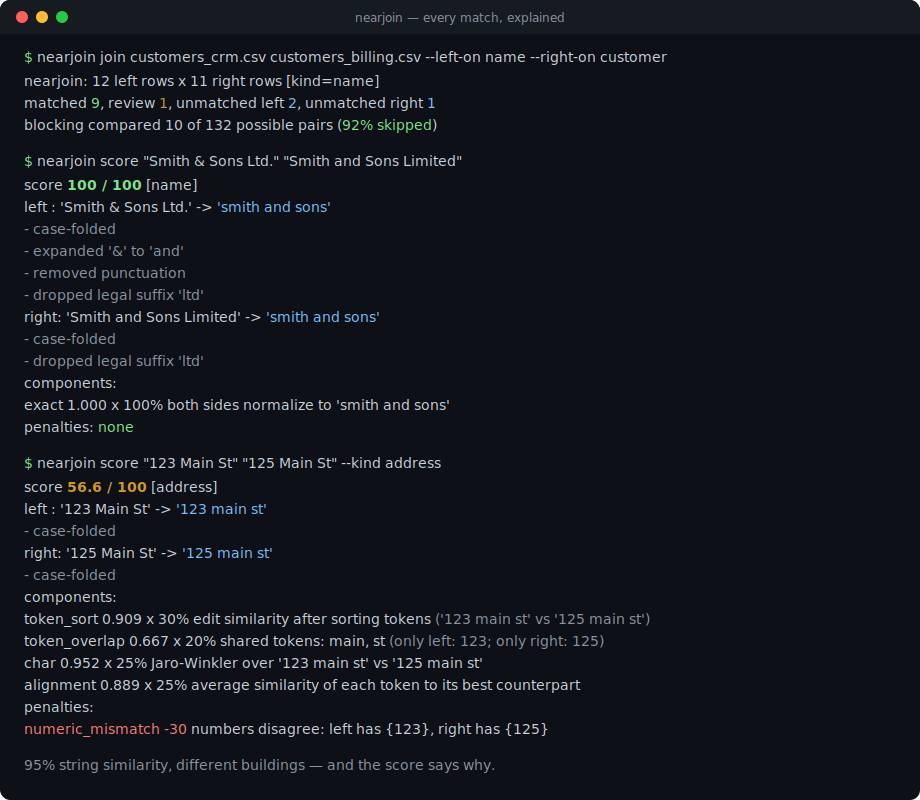
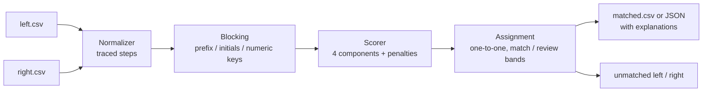

# nearjoin

[English](README.md) | [中文](README.zh.md) | [日本語](README.ja.md)

[](LICENSE) [](CHANGELOG.md) [](pyproject.toml)  [](CONTRIBUTING.md)

**开源的两表模糊连接工具，按名称或地址匹配——零依赖，每一条匹配都附带可解释的分数。**



```bash
git clone https://github.com/JaydenCJ/nearjoin && cd nearjoin && pip install -e .
```

> **预发布：** nearjoin 尚未发布到 PyPI。首个正式版本发布前，请克隆 [JaydenCJ/nearjoin](https://github.com/JaydenCJ/nearjoin) 并在仓库根目录执行 `pip install -e .`。

## 为什么选 nearjoin？

把两个系统导出的客户列表对到一起，是一件普遍、枯燥且 Excel 极不擅长的事：VLOOKUP 在第一个 "Acme, Inc." 对 "ACME Corporation" 处就阵亡了，而重量级的记录链接框架给你的答案是一个需要配置、训练、再向只想知道*第 40 行为什么匹配了第 7 行*的干系人辩护的概率模型。nearjoin 押了相反的注：带完整记录的确定性归一化、四个透明的相似度分量、显式的罚分——输出里的每一个分数都能按 [docs/scoring.md](docs/scoring.md) 手工复算。它刻意**不做** ML 记录链接框架：不需要训练数据、没有学习得到的权重、不依赖 SQL 后端——如果你有百万行数据和标注好的匹配对，请用 Splink；如果你手里是两份导出文件和一个截止日期，用它。

|  | nearjoin | Splink | dedupe | RapidFuzz |
|---|---|---|---|---|
| 一条命令完成 CSV 到 CSV 的连接 | 是 | 否（Python + SQL 后端） | 否（先做训练会话） | 否（仅相似度库） |
| 逐条匹配的解释 | 分量 + 罚分 + 归一化轨迹 | 模型参数（m/u 概率） | 分类器置信度 | 只有裸分数 |
| 需要训练数据或标注会话 | 否 | EM 训练 / 先验 | 是（主动学习） | 否 |
| 内置名称/地址归一化 | 是，每一步都有记录 | 自己实现 | 自己实现 | 无 |
| 把数字漂移（"123" 对 "125"）当作证据 | 是，显式罚分 | 可配置 | 学习得到，不透明 | 无 |
| 运行时依赖 | 0 | DuckDB、pandas 等 | scikit-learn 全家桶 | 编译的 C++ 扩展 |

<sub>依赖数量为 2026-07 时各包在 PyPI 上声明的运行时需求：splink 4.x 与 dedupe 3.x 各自拉入一套数值/SQL 栈；RapidFuzz 是单个编译 wheel。nearjoin 的数量即 [pyproject.toml](pyproject.toml) 中的 `dependencies = []`。</sub>

## 功能

- **每个分数都站得住脚** —— 每条匹配都携带各分量（`token_sort=0.82; char=0.93; …`）、罚分，以及两侧实际应用的归一化步骤；`nearjoin score --json` 把整个拆解以数据形式输出。
- **零运行时依赖** —— 纯标准库、离线、确定性：同样的两个文件在任何机器上的每次运行都产生逐字节相同的输出。
- **懂领域的归一化，绝不悄悄进行** —— 法律后缀（`Inc`、`GmbH`、`Ltd` 长短拼写皆可）、`&`→`and`、重音、撇号、USPS 风格地址缩写（`Street`→`st`、`Fifth`→`5th`）——每一步都被记录并在解释中原样重放。
- **数字是证据，不是字符** —— "123 Main St" 对 "125 Main St" 字符串相似度 95%，却是 100% 不同的楼；显式的 `numeric_mismatch` 罚分把它挡在匹配之外，并说明原因。
- **内置且可度量的分块（blocking）** —— 前缀、首字母和数字键在打分前削减笛卡尔积（自带示例上跳过 92%），摘要精确报告实际比较了多少对。
- **用复核区间取代虚假自信** —— 分数落入 `match`（≥85）、`review`（70–85）或不匹配；贪心一对一分配是确定性的，按行序打破平局。
- **CSV 进，CSV 或 JSON 出** —— 加前缀的列名避免冲突，`--unmatched-left/right` 收纳落单行，摘要走 stderr，stdout 保持可管道。

## 快速上手

安装：

```bash
git clone https://github.com/JaydenCJ/nearjoin && cd nearjoin && pip install -e .
```

在两份自带示例导出的公司名称列上做连接：

```bash
nearjoin join examples/customers_crm.csv examples/customers_billing.csv \
  --left-on name --right-on customer
```

真实捕获的输出（CSV 到 stdout，摘要到 stderr；以 `...` 截断）：

```text
left_id,left_name,...,match_score,match_verdict,match_explanation
C001,"Acme, Inc.",...,100,match,exact after normalization ('acme')
C003,Smith & Sons Ltd,...,100,match,exact after normalization ('smith and sons')
C004,Northwind Traders,...,77.6,review,token_sort=0.82; token_overlap=0.50; char=0.93; alignment=0.79
C007,Café Aurora,...,100,match,exact after normalization ('cafe aurora')
...
nearjoin: 12 left rows x 11 right rows [kind=name]
  matched 9, review 1, unmatched left 2, unmatched right 1
  blocking compared 10 of 132 possible pairs (92% skipped)
```

审问任意一对值——这就是你可以直接贴进发给财务的邮件里的输出：

```bash
nearjoin score "123 Main St" "125 Main St" --kind address
```

```text
score 56.6 / 100  [address]
  left : '123 Main St' -> '123 main st'
         - case-folded
  right: '125 Main St' -> '125 main st'
         - case-folded
  components:
    token_sort    0.909 x 30%  edit similarity after sorting tokens ('123 main st' vs '125 main st')
    token_overlap 0.667 x 20%  shared tokens: main, st (only left: 123; only right: 125)
    char          0.952 x 25%  Jaro-Winkler over '123 main st' vs '125 main st'
    alignment     0.889 x 25%  average similarity of each token to its best counterpart
  penalties:
    numeric_mismatch -30  numbers disagree: left has {123}, right has {125}
```

## CLI 参考

| 选项 | 默认值 | 作用 |
|---|---|---|
| `--left-on` / `--right-on` | 必填 / 同左侧 | 各文件中的连接列 |
| `--kind` | `auto` | `name`、`address`，或从数据自动检测 |
| `--threshold` | `85` | 分数达到此值的对判为 `match` |
| `--review` | `70` | 落在 `[review, threshold)` 的对标记为人工复核 |
| `--many` | 关 | 允许一个右行服务多个左行（默认一对一） |
| `--format` | `csv` | `json` 会为每条匹配附上完整解释 |
| `-o`、`--unmatched-left`、`--unmatched-right` | stdout / — | 把匹配与落单行写入文件 |
| `--no-explain` / `--quiet` | 关 | 去掉解释列 / 关闭摘要 |

打分模型——分量、权重、罚分及完整算例——见 [docs/scoring.md](docs/scoring.md)；`nearjoin keys VALUE` 可以查看任何值如何归一化以及会拿到哪些分块键。0.1.0 的归一化规则面向拉丁字母名称和美式地址；其他地区的数据可无损通过通用管线，只是不享受领域规则。

## 验证

本仓库不带任何 CI；上述所有断言均由本地运行验证。在本仓库的检出中即可复现：

```bash
pip install -e '.[dev]' && pytest && bash scripts/smoke.sh
```

输出（摘自真实运行，以 `...` 截断）：

```text
91 passed in 0.55s
...
[score]     numeric_mismatch -30  numbers disagree: left has {123}, right has {125}
SMOKE OK
```

## 架构



## 路线图

- [x] 带轨迹的归一化、分块、透明打分模型、含复核区间的一对一分配、CSV/JSON CLI（v0.1.0）
- [ ] 发布到 PyPI，支持 `pip install nearjoin`
- [ ] 可插拔的归一化规则包，覆盖更多地区与地址风格
- [ ] 多列连接：把名称与地址证据合并进一个分数
- [ ] 面向百万行输入的分块/流式模式

完整列表见 [open issues](https://github.com/JaydenCJ/nearjoin/issues)。

## 参与贡献

欢迎贡献——从一个 [good first issue](https://github.com/JaydenCJ/nearjoin/issues?q=is%3Aissue+is%3Aopen+label%3A%22good+first+issue%22) 开始，或发起一个 [discussion](https://github.com/JaydenCJ/nearjoin/discussions)。开发环境搭建见 [CONTRIBUTING.md](CONTRIBUTING.md)。

## 许可证

[MIT](LICENSE)
